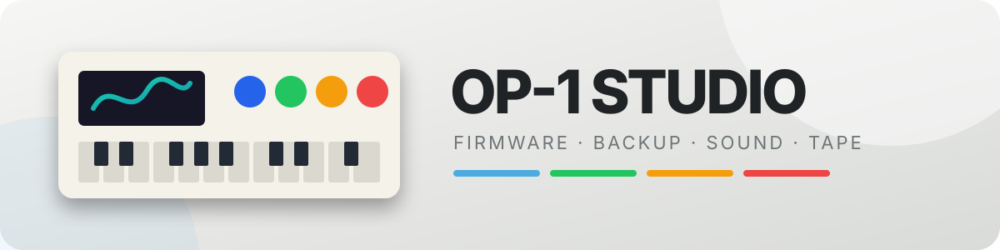

# OP-1 Studio

> Le bureau de controle pour apprivoiser un OP-1 sans lui faire peur.

OP-1 Studio rassemble firmware, sauvegardes, sons, MIDI et creation de pistes dans une interface locale inspiree de la machine. L'application prefere montrer exactement ce qu'elle prepare plutot que de cliquer tres fort sur un bouton magique.



> [!IMPORTANT]
> Projet communautaire independant, sans affiliation avec Teenage Engineering. Les marques, firmwares et fichiers de la machine restent la propriete de leurs ayants droit.

## Ce qui est deja la

- **Firmware** : catalogue de mods, apercus, options documentees et moteur `op1repacker` local pour preparer un build valide.
- **Bibliotheque Sons** : preflight WAV/AIFF, classement synth/drum, conversion mono 44.1 kHz / 16 bits et creation de patches.
- **Sauvegardes** : organisation locale, manifestes et preparation de Time Capsule pour Tape/Album.
- **Studio** : clone visuel OP-1, quatre pistes, machine Tape, vue globale de six minutes, piano-roll et capture MIDI temporelle.
- **MIDI** : detection Web MIDI, clavier jouable depuis l'ordinateur, envoi de notes vers la sortie OP-1 et capture des notes entrantes.
- **Audio USB** : tentative de routage du son OP-1 quand le navigateur expose l'appareil comme interface audio.

## La regle d'or

Les operations sensibles restent explicites. Les bridges locaux preparent, valident et produisent des manifestes ; l'interface ne pretend pas avoir ecrit sur la machine quand elle ne l'a pas fait. Autrement dit : le bouton ne porte pas de cape.

## Demarrage

Prerequis : Node.js, Python 3 et, pour les outils audio, FFmpeg. Depuis la racine :

```powershell
npm install
npm run dev
```

Puis ouvrir `http://localhost:3000` avec Chrome ou Edge pour Web MIDI et l'audio USB.

Installation des outils locaux :

```powershell
.\tools\Install-OP1StudioTools.ps1 -All
```

## Outils en ligne de commande

```powershell
python tools/sample_preflight.py --help
python tools/project_bridge.py --help
python tools/firmware_bridge.py --help
python tools/patch_bridge.py --help
python tools/tape_bridge.py --help
python tools/device_inventory.py "E:"
python tools/backup_manifest.py create "E:" backups/hardware-tests --label op1-disk
```

Les bridges travaillent dans des dossiers de sortie separes. `device_inventory.py`
inspecte un volume monte en lecture seule et `backup_manifest.py` copie puis
verifie un snapshot local. Le transfert direct vers le volume OP-1 est
volontairement bloque tant que le moteur de changement securise n'est pas termine.

## Tests

```powershell
npm run build
npm test
npm run lint
python -m unittest tests/test_project_bridge.py tests/test_firmware_inspector.py
```

## Architecture actuelle

```text
app/page.tsx             interface et fenetres de travail
app/globals.css          langage visuel OP-1 Studio
tools/                   bridges locaux audio, firmware, patches et projets
data/firmware/           catalogue des releases et mods
docs/                    feuille de route, audits et recherches
tests/                   tests UI et contrats Python
```

## Feuille de route

1. rendre le piano-roll editable avec quantification et relecture MIDI ;
2. calculer les vraies formes d'onde et les niveaux audio ;
3. finaliser le moteur de changement securise pour sauvegarde et transfert ;
4. brancher Album, mixage et export ;
5. empaqueter l'application desktop avec un bridge natif pour les volumes USB et l'audio de sortie.

Voir [docs/ROADMAP.md](docs/ROADMAP.md) et [docs/PROJECT_STATUS.md](docs/PROJECT_STATUS.md) pour le detail et les limites connues.

## Contribuer

Lire [CONTRIBUTING.md](CONTRIBUTING.md), choisir un jalon, ajouter un test quand un contrat change et garder les operations machine verifiables. Une bonne contribution doit laisser moins de surprises qu'elle n'en trouve.

## Licence

Le code du depot est distribue sous **AGPL-3.0-only**. Les dependances, firmwares et ressources externes conservent leurs licences respectives ; voir [NOTICE.md](NOTICE.md).
