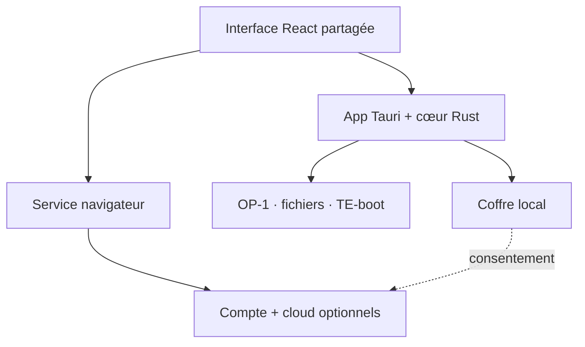

  

  <strong>L’app et le service qui réunissent enfin tout l’OP‑1 original.</strong> 
  Firmware, sauvegardes, sons et morceaux — avec un plan vérifiable avant chaque écriture.

  
  
  
  

> [!IMPORTANT]
> OP‑1 Studio est un projet communautaire indépendant. Il n’est ni affilié, ni approuvé, ni maintenu par Teenage Engineering. Les marques et firmwares appartiennent à leurs propriétaires respectifs.

## Une seule maison pour l’OP‑1

L’OP‑1 original expose ses morceaux, sons et réglages comme des fichiers, mais les opérations sont dispersées entre le mode disque, le mode TE‑boot et plusieurs utilitaires communautaires. OP‑1 Studio vise une expérience cohérente : l’application comprend le contexte de la machine, prépare les changements, montre exactement ce qui sera écrit, puis vérifie le résultat. Le service navigateur prolonge cette expérience avec un compte et un cloud optionnels.

| Espace | Ce que l’on veut offrir |
|---|---|
| **Machine** | Détection de l’OP‑1, état du stockage, mode courant et éjection sûre |
| **Sauvegardes** | Instantanés horodatés, manifestes SHA‑256, comparaison et restauration contrôlée |
| **Sons** | Bibliothèque locale, écoute, conversion et transfert des patches synthé/batterie |
| **Tape & Album** | Aperçu des quatre pistes, export des stems et rendu WAV/FLAC |
| **Firmware** | Contrôle central : versions, sauvegarde préalable, validation et assistant TE‑boot |
| **Studio** | Préparation visuelle de quatre stems compatibles avec la bande de l’OP‑1 |

## La règle d’or : aucune surprise

- Lecture seule lors de la découverte d’une machine.
- Sauvegarde vérifiée avant toute restauration ou mise à jour sensible.
- Plan de changements visible avant écriture.
- Firmware officiel uniquement dans le parcours normal.
- Synchronisation, éjection et confirmation explicites avant de débrancher.
- Aucune télémétrie ni mise en ligne des sons sans consentement.

## Architecture hybride

Le contrôle matériel vit dans une app **Tauri 2 + React/TypeScript + Rust**. Une page web ne peut pas accéder de façon portable et sûre à un périphérique de stockage USB ni l’éjecter sur tous les systèmes. Le même front-end alimente un service navigateur pour la bibliothèque, le compte et le cloud. Les fonctions essentielles restent utilisables hors ligne.

## État du projet

Le dépôt contient aujourd’hui les fondations produit et techniques. Aucun binaire utilisable n’est encore publié.

- [x] Cartographie de l’OP‑1 original et de ses modes USB
- [x] Politique de sécurité firmware et sauvegarde
- [x] Audit des principaux outils libres existants
- [x] Architecture hybride et étude du marché
- [x] Prototype interactif du Firmware Control Center
- [ ] Détecteur de machine en lecture seule
- [ ] Sauvegarde vérifiée et explorateur de fichiers
- [ ] Bibliothèque de sons et conversion audio
- [ ] Assistant firmware officiel
- [ ] Studio d’arrangement quatre pistes

## Commencer à contribuer

1. Lire la [vision produit](docs/PRODUCT_VISION.md) et la [base de connaissances OP‑1](docs/OP1_KNOWLEDGE_BASE.md).
2. Examiner les [règles de sécurité firmware](docs/FIRMWARE_SAFETY.md).
3. Choisir un jalon dans la [feuille de route](docs/ROADMAP.md).
4. Suivre le guide [CONTRIBUTING.md](CONTRIBUTING.md).

Les documents officiels ne sont pas recopiés dans le dépôt. Le script [`scripts/fetch-official-docs.sh`](scripts/fetch-official-docs.sh) permet d’en créer un cache local depuis les URL de Teenage Engineering.

## Documentation

- [Architecture technique](docs/ARCHITECTURE.md)
- [Analyse du marché](docs/MARKET_ANALYSIS.md)
- [Modèle économique](docs/BUSINESS_MODEL.md)
- [Base de connaissances OP‑1](docs/OP1_KNOWLEDGE_BASE.md)
- [Sécurité du firmware](docs/FIRMWARE_SAFETY.md)
- [Audit des outils existants](docs/TOOLING_AUDIT.md)
- [Sources et références](docs/SOURCES.md)
- [Licence et mentions](NOTICE.md)

## Licence

Le code original de ce dépôt est distribué sous **GNU Affero GPL v3.0 uniquement** (`AGPL-3.0-only`). Cette licence couvre aussi les versions modifiées proposées comme service réseau, tout en autorisant un abonnement pour l’hébergement, le stockage et le support. Chaque dépendance conserve sa propre licence ; consulter [NOTICE.md](NOTICE.md). Ce choix ne remplace pas un avis juridique avant commercialisation.
