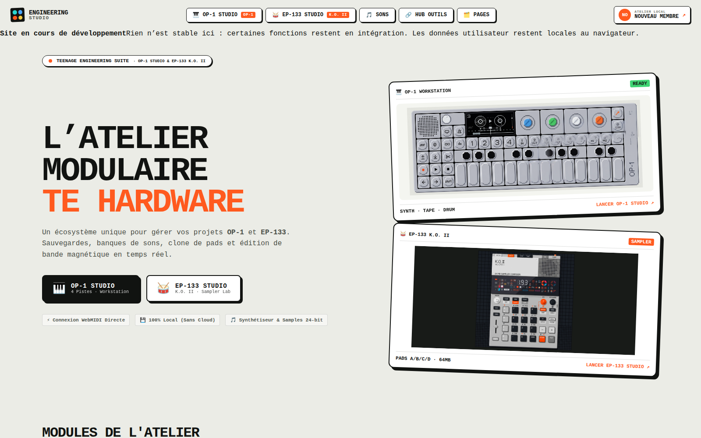
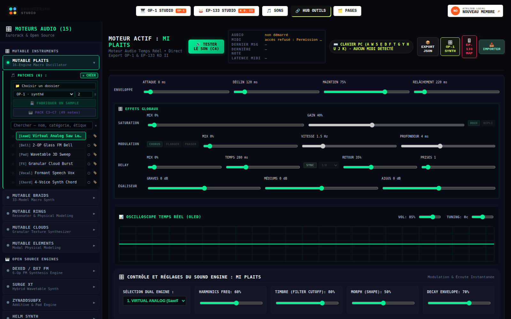
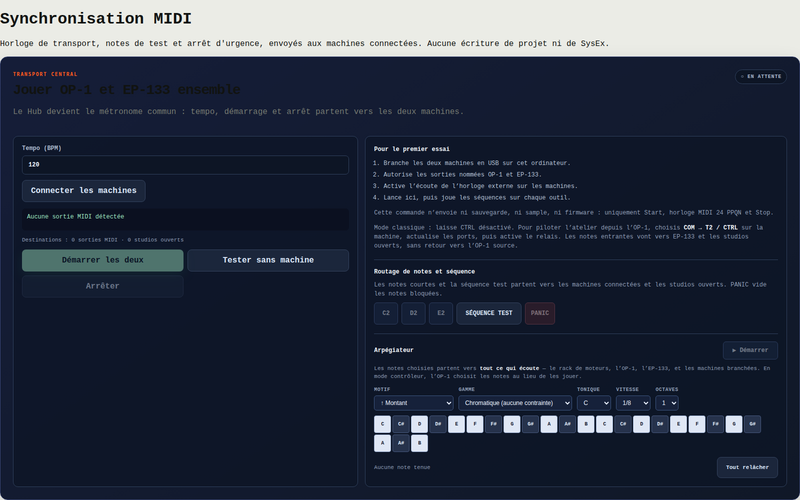
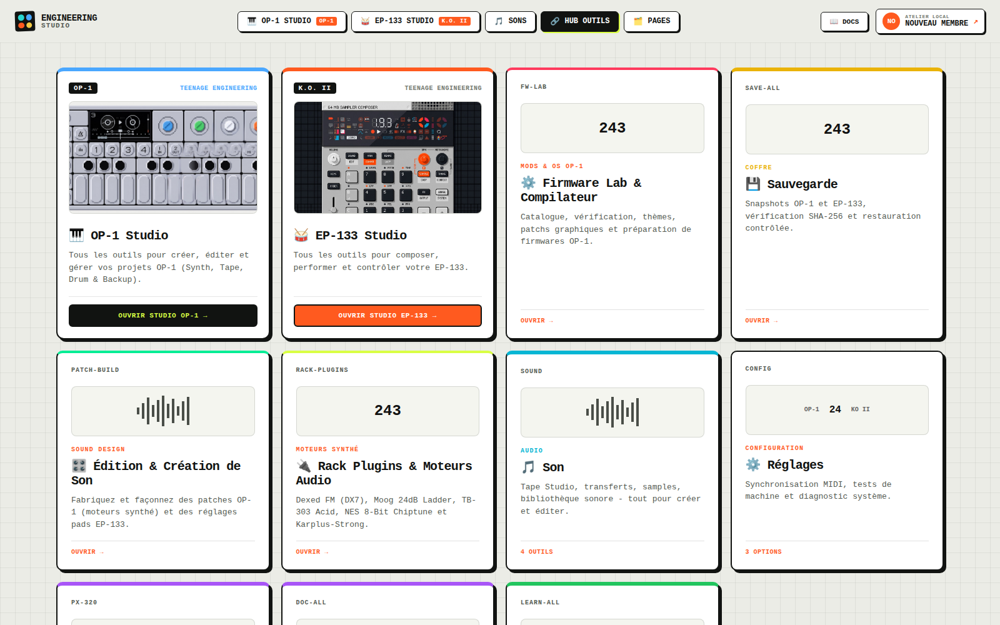

# Engineering Studio

Un atelier **local-first** pour les machines de Teenage Engineering — OP-1 et
EP-133 K.O. II. Sauvegardes vérifiées, transferts MIDI, édition de samples,
firmware, et un rack de synthèse qui joue du son **sans qu'aucune machine soit
branchée**.

Tout se passe dans le navigateur. Aucune donnée ne part sur un serveur : les
dossiers ne sont lus qu'après que vous les ayez choisis, et le profil reste
dans le navigateur.

- Dépôt : https://github.com/propann/Engineering-Studio
- Hub en ligne : https://engineering-studio.duckdns.org

---

## Les trois racks

C'est la règle d'architecture du projet, et elle décide où va chaque nouvelle
fonction : **le rack MIDI produit les notes, le rack de moteurs en fait du son,
le rack d'effets le traite.**

| Rack | Métier | Où il vit |
|---|---|---|
| **MIDI** | produit les notes — arpégiateur, 30 gammes, horloge, relais | `packages/musique/`, panneau `MidiSyncPanel` |
| **Moteurs** | en fait du son — 15 moteurs, 91 patches | `pages/AudioPluginRack.tsx` |
| **Effets** | traite le son — saturation, égaliseur, modulation, délai | `core/audio/effets.ts` + `racks/RackEffets.tsx` |

Chaque rack **porte son interface**. Un test l'empêche de revenir en arrière :
aucun réglage d'effet ne peut réapparaître dans le rack de moteurs, aucune
commande d'arpège dans le panneau MIDI.

C'est cette séparation qui décide de l'emplacement de l'arpégiateur. Posé dans
le rack de moteurs, il n'arpégerait que lui ; là où il est, il atteint **tout ce
qui écoute** — le rack, l'OP-1, l'EP-133 et n'importe quelle machine branchée.

### Rack de moteurs

Quinze moteurs de synthèse — la suite Mutable Instruments (Plaits, Braids,
Rings, Clouds, Elements) et dix moteurs libres (Dexed/DX7 FM, Surge XT,
ZynAddSubFX, Helm, FluidSynth, amsynth, AMY, pl_synth, Open303, Faust).
91 patches d'usine, superposition de patches, oscilloscope, et fabrication
d'échantillons rendus hors ligne puis **relus et comparés par empreinte**.

### Rack MIDI

Horloge de transport partagée, relais de contrôleur, et un arpégiateur qui
quantifie sur **30 gammes** — les deux pentatoniques, les sept modes majeurs,
les mineures altérées, les symétriques, neuf gammes du monde et trois de jazz.

### Rack principal

Le rack où sont rangées les applications : studios, firmware, sauvegarde,
édition de son, documentation.

---

## Où en est le projet

La distinction qui compte n'est pas « fait / à faire » mais **« prouvé par des
tests / prouvé sur du matériel »**. Un test qui passe ne dit rien de ce que la
machine fait du fichier qu'on lui écrit.

| | |
|---|---|
| 743 tests automatiques | ✅ verts, vérifiés par sabotage |
| Lecture de l'OP-1 (66 fichiers, comparés octet par octet) | ✅ sur matériel |
| Écriture vérifiée sur l'OP-1, au niveau fichier | ✅ sur matériel |
| L'OP-1 relit son support après écriture externe | ✅ sur matériel |
| MIDI vers l'OP-1 et l'EP-133 | ✅ sur matériel |
| Restauration par l'application, de bout en bout | ⬜ protocole prêt, non exécuté |
| Les trois racks, à l'oreille | ⬜ 98 essais consignés, à faire |

Ce qui reste à valider est listé, essai par essai, dans
[docs/TESTS_PHYSIQUES.md](docs/TESTS_PHYSIQUES.md) — avec, pour chacun, ce que
les tests automatiques ne peuvent pas prouver.

### La règle de test

> **Un test qui ne peut pas échouer ne prouve rien.**

Chaque garde-fou du dépôt a été vérifié par sabotage : on casse volontairement
le code, on vérifie que le test concerné tombe — et qu'aucun autre ne tombe avec
lui. Plusieurs tests écrits ici se sont révélés incapables d'échouer, et ne
l'ont montré que sous sabotage. Ils sont corrigés, et l'histoire est gardée dans
les messages de commit.

---

## Arborescence

~~~text
Engineering-Studio/
├── apps/
│   ├── studio-hub/       application principale déployée
│   ├── op1-studio/       studio OP-1 (intégré au Hub)
│   └── ep133-studio/     studio EP-133 (intégré au Hub)
├── packages/
│   ├── audio-bridge/     journalisation et utilitaires audio
│   ├── audio-formats/    AIFF et WAV — lecture, écriture, specs machines
│   ├── fs-handles/       poignées de dossiers persistées
│   ├── midi-bridge/      types et messages entre Hub et studios
│   ├── midi-dispatch/    un seul abonnement MIDI, plusieurs auditeurs
│   └── musique/          gammes, arpèges, divisions, sélecteur partagé
├── docs/                 documentation classée
├── scripts/              vérifications et opérations de dépôt
└── vite.config.ts        configuration du Hub et de Coolify
~~~

Le build racine utilise `apps/studio-hub` comme racine Vite et sert le résultat
sur le port 3000. Les deux studios sont **intégrés au Hub**, pas déployés comme
services séparés.

> À savoir avant de toucher aux alias : le `vite.config.ts` qui construit est
> celui de la **racine**. Un alias doit être déclaré à trois endroits —
> `vite.config.ts`, les `paths` de `tsconfig.json`, et `vitest.config.ts` qui
> tient sa propre liste. En oublier un donne typecheck et build verts, et des
> tests qui échouent sur `Cannot find package`.

---

## Démarrage local

Pré-requis : Node.js 20+ et Bun.

~~~bash
git clone https://github.com/propann/Engineering-Studio.git
cd Engineering-Studio
bun install --frozen-lockfile
bun run dev
~~~

Ouvrir http://localhost:3000.

~~~bash
bun run typecheck   # ne pas s'en dispenser : le build ne typecheck pas
bun run test
bun run build
~~~

> `bun run build` passe avec des erreurs de type — Vite transpile sans vérifier.
> Seul `typecheck` les voit. Un dépôt peut être rouge avec un build vert.

### Ce qui exige un contexte sécurisé

Web MIDI et File System Access n'existent que dans un contexte sécurisé.
`http://localhost` en est un ; `http://192.168.x.x` non — `showDirectoryPicker`
y est *absent*, pas seulement bloqué.

Un HTTPS auto-signé accorde `isSecureContext` **mais bloque quand même** ces
fonctions : le MIDI reste silencieux, sans erreur. C'est un piège qui a déjà
coûté une session de diagnostic.

---

## Déploiement Coolify

~~~text
Repository : propann/Engineering-Studio
Branch     : main
Root       : /
Port       : 3000
Domain     : https://engineering-studio.duckdns.org

Install : bun install --frozen-lockfile
Build   : bun run build
Start   : bun run preview --host 0.0.0.0 --port 3000
~~~

Voir [DEPLOIEMENT.md](DEPLOIEMENT.md) pour le health check et les erreurs déjà
rencontrées.

---

## Données utilisateur

Engineering Studio est local-first :

- le profil est stocké dans `localStorage` sous `studio-hub-profile` ;
- aucun profil n'est fourni par le serveur ;
- les dossiers ne sont accessibles qu'après sélection explicite ;
- un nouvel arrivant démarre avec un profil neutre, sans machine préchargée.

Voir [docs/guides/NEW_USER_DATA_MODEL.md](docs/guides/NEW_USER_DATA_MODEL.md).

**Toute écriture sur une machine est précédée d'une sauvegarde vérifiée**, et le
disque se monte en lecture seule par défaut pendant les essais.

---

## Documentation

| | |
|---|---|
| [Index documentaire](docs/INDEX.md) | point d'entrée |
| [État du projet](docs/STATUS.md) | où en est chaque chantier |
| [Modules](MODULES_STATUS.md) | les douze modules du rack, un par un |
| [Feuille de route](docs/ROADMAP.md) | ce qui a été fait, et ce que ça a appris |
| [Tests physiques](docs/TESTS_PHYSIQUES.md) | ce que les tests automatiques ne prouvent pas |
| [Contrat du coffre](docs/backup/CONTRAT_INTEGRATION.md) | pour qui construit dessus |
| [Architecture](docs/architecture/ARCHITECTURE_CURRENT.md) | vue d'ensemble |
| [Stratégie Git](docs/guides/BRANCHING_STRATEGY.md) | branches et publication |

Les documents de `docs/archived/` sont historiques. Ils ne remplacent pas la
vérification du code actuel.

---

## Git

`main` est la branche de référence et de production. Rien n'y arrive sans être
passé par `validation` et par un CI vert.

~~~bash
git switch main
git pull --ff-only origin main
git switch -c feature/nom-court
~~~

Jamais de secrets, de `node_modules`, de `dist` ni de fichiers locaux dans un
commit. Préserver les modifications utilisateur non liées au travail en cours.

Les captures de ce fichier se refont avec
[`docs/assets/captures/_capture.mjs`](docs/assets/captures/_capture.mjs), qui
pilote Chromium par son protocole de débogage — le Hub n'ayant pas de routage
par URL, un simple `--screenshot` ne peut atteindre que l'accueil.

## Licence

Voir les licences des modules et paquets concernés. Toute nouvelle partie doit
conserver une licence compatible avec les fichiers qu'elle modifie.
