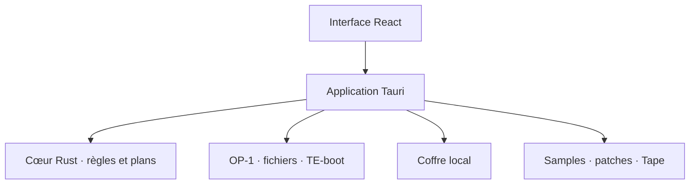

<p align="center">
  
</p>

<p align="center">
  <strong>L’app et le service qui réunissent enfin tout l’OP‑1 original.</strong><br>
  Firmware, sauvegardes, sons et morceaux — avec un plan vérifiable avant chaque écriture.
</p>

<p align="center">
  <a href="LICENSE"></a>
  
  
  
</p>

<p align="center">
  <a href="https://op1-studio.azoth217.chatgpt.site"><strong>Ouvrir le prototype Firmware Control Center →</strong></a>
</p>

> [!IMPORTANT]
> OP‑1 Studio est une application communautaire indépendante. Elle n’est ni affiliée, ni approuvée, ni maintenue par Teenage Engineering. Les marques et firmwares appartiennent à leurs propriétaires respectifs.

## Une seule maison pour l’OP‑1

L’OP‑1 original expose ses morceaux, sons et réglages comme des fichiers, mais les opérations sont dispersées entre le mode disque, le mode TE‑boot et plusieurs utilitaires communautaires. OP‑1 Studio vise une expérience cohérente : l’application comprend le contexte de la machine, prépare les changements, montre exactement ce qui sera écrit, puis vérifie le résultat. Elle fonctionne localement, hors ligne et sans abonnement.

| Espace | Ce que l’on veut offrir |
|---|---|
| **Machine** | Détection de l’OP‑1, état du stockage, mode courant et éjection sûre |
| **Sauvegardes** | Instantanés horodatés, manifestes SHA‑256, comparaison et restauration contrôlée |
| **Machine** | Explorateur, remplissage contrôlé et éjection sûre |
| **Sons & patches** | Bibliothèque locale, écoute, conversion et transfert des samples, patches synthé et kits batterie |
| **Tape & Album** | Aperçu des quatre pistes, export des stems et rendu WAV/FLAC |
| **Firmware** | Contrôle central : versions, sauvegarde préalable, validation et assistant TE‑boot |
| **Studio** | Préparation visuelle de quatre stems compatibles avec la bande de l’OP‑1 |

## La règle d’or : aucune surprise

- Lecture seule lors de la découverte d’une machine.
- Sauvegarde vérifiée avant toute restauration ou mise à jour sensible.
- Plan de changements visible avant écriture.
- Firmware officiel uniquement dans le parcours normal.
- Synchronisation, éjection et confirmation explicites avant de débrancher.
- Aucune télémétrie ni mise en ligne des sons sans consentement.

## Architecture hybride



Le contrôle matériel vit dans une application **Tauri 2 + React/TypeScript + Rust**. Une page web ne peut pas accéder de façon portable et sûre à un périphérique de stockage USB ni l’éjecter sur tous les systèmes. L’interface web actuelle sert de prototype visuel ; la cible de production est l’application installable. Les fonctions essentielles restent utilisables hors ligne.

## État du projet

Le dépôt contient aujourd’hui les fondations produit et techniques. Aucun binaire utilisable n’est encore publié.

- [x] Cartographie de l’OP‑1 original et de ses modes USB
- [x] Politique de sécurité firmware et sauvegarde
- [x] Audit des principaux outils libres existants
- [x] Architecture hybride et étude du marché
- [x] Prototype interactif du Firmware Control Center
- [x] Inspecteur `.op1` en lecture seule : CRC‑32, SHA‑256, LZMA/TAR et chemins sûrs
- [x] Étude reproductible de l’OS officiel 246 et du pipeline unpack/repack
- [x] Catalogue des mods firmware vérifiés et classés par utilité/risque
- [x] Dépôt local universel : manifestes, provenance, hash et vérification
- [ ] Détecteur de machine en lecture seule
- [ ] Sauvegarde vérifiée et explorateur de fichiers
- [ ] Bibliothèque de samples, patches et kits batterie
- [ ] Assistant firmware officiel
- [ ] Studio d’arrangement quatre pistes

### Inspecter un firmware sans l’extraire

```bash
python3 tools/firmware_inspector.py ./op1_246.op1 --include-files
python3 -m unittest tests/test_firmware_inspector.py
```

L’inspecteur de référence n’écrit aucun fichier et ne touche jamais au volume de la machine. Il prépare le futur cœur Rust/Tauri et ne constitue pas encore un bouton d’installation.

Le flux local prévu pour l’application est déjà testable sans matériel :

```bash
python3 tools/firmware_fetch.py --version 246 --output firmware-downloads/op1_246.op1
python3 tools/backup_manifest.py create /chemin/du/volume-op1 backups/
python3 tools/backup_manifest.py verify backups/op1_*/

python3 tools/content_catalog.py init /chemin/vers/OP-1-Studio-Library
python3 tools/content_catalog.py scan /chemin/vers/OP-1-Studio-Library
python3 tools/content_catalog.py verify /chemin/vers/OP-1-Studio-Library
```

Le téléchargeur n’accepte que les URL HTTPS du catalogue officiel et valide le conteneur avant de déplacer le fichier final. La sauvegarde refuse les destinations dangereuses, ne suit pas les liens symboliques et vérifie chaque copie par SHA‑256.

Le coffre de contenu reste séparé du dépôt Git : il peut contenir les patches,
samples, Tape, thèmes, sauvegardes et firmwares locaux de l’utilisateur, mais
les fichiers inconnus restent en quarantaine et les contenus tiers ne sont pas
redistribués.

## Commencer à contribuer

1. Lire la [vision produit](docs/PRODUCT_VISION.md) et la [base de connaissances OP‑1](docs/OP1_KNOWLEDGE_BASE.md).
2. Examiner les [règles de sécurité firmware](docs/FIRMWARE_SAFETY.md).
3. Choisir un jalon dans la [feuille de route](docs/ROADMAP.md).
4. Suivre le guide [CONTRIBUTING.md](CONTRIBUTING.md).

Les documents officiels ne sont pas recopiés dans le dépôt. Le script [`scripts/fetch-official-docs.sh`](scripts/fetch-official-docs.sh) permet d’en créer un cache local depuis les URL de Teenage Engineering.

## Documentation

- [Architecture technique](docs/ARCHITECTURE.md)
- [Analyse du marché](docs/MARKET_ANALYSIS.md)
- [Modèle économique](docs/BUSINESS_MODEL.md)
- [Base de connaissances OP‑1](docs/OP1_KNOWLEDGE_BASE.md)
- [Sécurité du firmware](docs/FIRMWARE_SAFETY.md)
- [Laboratoire firmware : outils, format et étude OS 246](docs/FIRMWARE_LAB.md)
- [Catalogue des mods firmware](docs/FIRMWARE_MOD_CATALOG.md)
- [Dépôt local universel de contenu](docs/CONTENT_LIBRARY.md)
- [Périmètre de l’application](docs/APP_SCOPE.md)
- [Éditeur simple de patches](docs/PATCH_EDITOR_SPEC.md)
- [Audit des outils existants](docs/TOOLING_AUDIT.md)
- [Sources et références](docs/SOURCES.md)
- [Licence et mentions](NOTICE.md)

## Licence

Le code original de ce dépôt est distribué sous **licence MIT**. Les forks, applications commerciales et services dérivés sont autorisés sous réserve de conserver la notice de copyright et de respecter les licences des dépendances. Cette licence ne couvre ni les firmwares propriétaires, ni les manuels, marques ou contenus de Teenage Engineering ; consulter [NOTICE.md](NOTICE.md).
