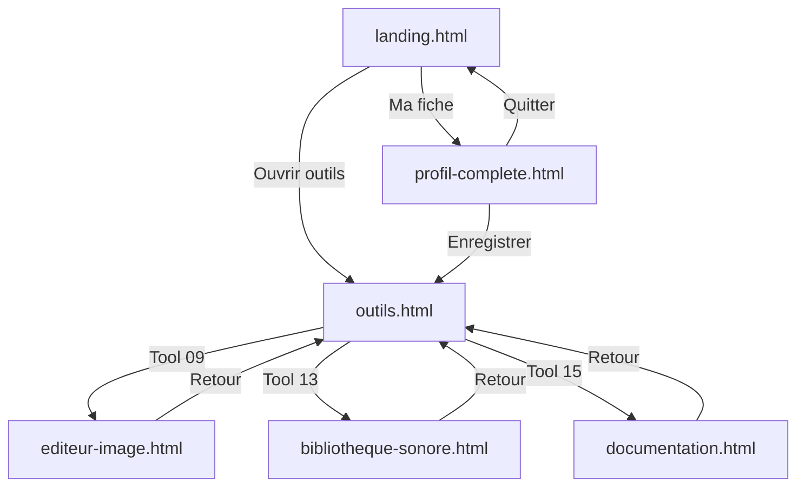

# 📋 Structure Engineering Studio - Maquette HTML

**Date**: 2026-08-18  
**Status**: ✅ COMPLET et FONCTIONNEL  
**Architecture**: Pages HTML/CSS/JS statiques + React intégration

---

## 📊 Vue d'ensemble

Le site Engineering Studio est organisé en **6 pages principales + 1 fiche de personnage**.

```
Landing Page
    ↓
├─→ Outils (16 modules)
├─→ Profil (40 avatars + config)
├─→ Éditeur d'Image
├─→ Bibliothèque Sonore
├─→ Documentation
```

---

## 🏗️ Architecture fichiers

### Structure publique
```
apps/studio-hub/public/
├── landing.html              (7.4K) - Page d'accueil
├── outils.html               (11K)  - 16 outils avec descriptions
├── profil-complete.html      (26K)  - Fiche personnage PIXELISÉE
├── editeur-image.html        (8.0K) - Drawpad pixel art
├── bibliotheque-sonore.html  (8.6K) - 12 sons organisés
├── documentation.html        (11K)  - Guide complet
└── media/
    ├── op1.jpeg (275K)       - Photo OP-1 pixel art
    ├── ep133.jpeg (512K)     - Photo EP-133 pixel art
    └── avatars/
        ├── pixel-avatar-engineer.webp
        ├── pixel-avatar-teacher.webp
        ├── ... (40 avatars total)
        └── pixel-avatar-explorer.webp
```

---

## 🎨 Design System

### Palette de couleurs (variables CSS)
```css
--ink: #111311;        /* Noir principal */
--paper: #ebece6;      /* Beige clair */
--orange: #ff5a1f;     /* Orange accent */
--acid: #d9ff43;       /* Jaune acide */
--blue: #4aa7ff;       /* Bleu clair */
--muted: #747970;      /* Gris neutre */
```

### Typographie
- **Famille**: "Courier New", monospace (pixel-style)
- **Poids**: 900 (headlines), 800 (labels), 700 (body), 500 (description)
- **Letter-spacing**: -0.09em (headlines), 0.1em (labels)

### Composants clés

#### 1. **Header/Topbar**
- Hauteur: 82px
- Contient: Brand + Navigation + Buttons
- Sticky en haut
- Border-bottom: 3px solid (ink)

#### 2. **Cards/Blocks**
- Border: 4px solid (ink)
- Box-shadow: 12px 12px 0 (ink)
- Hover: translate(-3px, -3px) + shadow shift
- Corner clipping: polygon (8px corners)

#### 3. **Input/Forms**
- Border: 3px solid (ink)
- Focus shadow: 4px 4px 0 var(--orange)
- Font: 800 12px monospace

---

## 📄 Détail des pages

### 1. **landing.html** - Page d'accueil
**Route**: `/landing.html` ou `/`

**Contenu**:
- Hero section avec titre "Construis. Connecte. Crée."
- Images des machines OP-1 + EP-133
- 2 boutons d'action (Outils / Créer fiche)
- Section intro des outils
- Footer

**Éléments clés**:
```html
<header class="topbar">
  <a class="brand">Engineering Studio</a>
  <button class="primary-action">Ma fiche →</button>
</header>

<section class="hero">
  <div class="hero-copy"><!-- Texte --></div>
  <div class="hero-machine"><!-- Images OP-1 + EP-133 --></div>
</section>

<section class="tools-section">
  <!-- Preview des 16 outils -->
</section>
```

**Navigation**: 
- → `outils.html` (Ouvrir les outils)
- → `profil-complete.html` (Ma fiche)

---

### 2. **outils.html** - Tableau des outils

**Route**: `/outils.html`

**Contenu**:
- Grille 4 colonnes de **16 outils**
- Chaque outil a: numéro, nom, description, tags
- Organisations par catégories:
  - 01-04: SYNTHÈSE (FM, Wavetable, Pluck, 808)
  - 05-08: SAMPLING (Sampler, Pitch, Slice, Granular)
  - 09-12: ÉDITION (Image, Palette, Pixeliser, Sprites)
  - 13-16: BIBLIOTHÈQUE (Sons, Analyse, Docs, Presets)

**Markup exemple**:
```html
<div class="tool-card" onclick="location.href='#'">
  <div class="tool-num">01 · SYNTHÈSE</div>
  <div class="tool-icon">🎹</div>
  <h3>Synth FM</h3>
  <p class="tool-desc">Synthèse par modulation de fréquence...</p>
  <span class="tool-tag">OP-1</span>
</div>
```

**Navigation**:
- ← `landing.html` (Brand)
- → `profil-complete.html` (Ma fiche)
- → `editeur-image.html` (Tool 09)
- → `bibliotheque-sonore.html` (Tool 13)
- → `documentation.html` (Tool 15)

---

### 3. **profil-complete.html** - Fiche de personnage

**Route**: `/profil-complete.html`

**Architecture**:
```
┌─ HEADER (creator-header) ─────────────────────┐
│ ← QUITTER  |  CRÉATION DU PERSONNAGE  | SAVE │
├─ PROGRESS BAR (creator-progress) ────────────┤
├─ LAYOUT (creator-layout) ────────────────────┤
│  ┌─ PLAYER PANEL ────┐   ┌─ FORM ──────────┐ │
│  │ Avatar Preview     │   │ 01. Identité    │ │
│  │ Statistiques       │   │ 02. Équipement  │ │
│  │ Privé/Local        │   │ 03. Workspace   │ │
│  └────────────────────┘   │ 04. Préférences │ │
│                           │ [ENREGISTRER]   │ │
│                           └─────────────────┘ │
└──────────────────────────────────────────────┘
```

**Sections du formulaire**:

#### Block 01: IDENTITÉ
- Input: Pseudo (maxlength 40)
- Textarea: Présentation (maxlength 160)
- **Avatar Grid**: 40 avatars en grille sélectionnable
  - Grid: 8 colonnes × 5 rangées
  - Chaque avatar: image + numéro + hover effect
  - Click: sélection + preview update

```javascript
// Sélection avatar
avatarNames.forEach((name, idx) => {
  const btn = document.createElement('button');
  btn.onclick = () => selectAvatar(name);
  btn.innerHTML = ``;
  grid.appendChild(btn);
});
```

#### Block 02: ÉQUIPEMENT
- **Loadout List**: Chaque machine
  ```
  [Power Toggle] [Icon] [Name Input] [Model Select] [Memory] [Delete]
  ```
- Ajouter OP-1 / EP-133 buttons

#### Block 03: BASE LOCALE
- Workspace selector (folder icon)
- Connected state toggle
- Affichage dossier

#### Block 04: RÉGLAGES
- Choice selector: Langue (FR/EN)
- Choice selector: Clavier (AZERTY/QWERTY)
- Choice selector: Thème (PIXEL/LIGHT)

**Sauvegarde**:
```javascript
localStorage.setItem('studio-profile', JSON.stringify({
  version: 1,
  name: "AZOTH",
  avatar: "engineer",
  bio: "...",
  machines: [...],
  workspace: { name: "ENGINEERING_STUDIO" },
  language: "FR",
  keyboard: "AZERTY",
  theme: "PIXEL",
  createdAt: "2026-08-18T..."
}));
```

**40 Avatars disponibles**:
```
teacher, carpenter, artist, barista, support, architect, activist, 
mail-carrier, builder, scientist, student, librarian, trainer, 
office-worker, influencer, chef, courier, grandma, musician, paramedic, 
knight, rogue, smith, archer, scholar, warrior, goblin, cyborg, 
cat-adventurer, pirate, sorceress, viking, engineer, necromancer, 
ranger, royal-guard, fighter, samurai, cultist, explorer
```

**Navigation**:
- ← `landing.html` (Quitter)
- → `outils.html` (Après enregistrement)

---

### 4. **editeur-image.html** - Éditeur pixel art

**Route**: `/editeur-image.html`

**Contenu**:
- **Canvas**: 480×480px pixel art drawing
- **Palette**: 9 couleurs (orange, blue, acid, green, red, etc.)
- **Outils**:
  - Pencil (brush)
  - Eraser
  - Fill bucket
- **Contrôles**:
  - Size slider: 1-20px
  - Clear button
  - Download PNG

**Événements**:
```javascript
canvas.addEventListener('mousemove', draw);
// Chaque pixel = carré coloré
ctx.fillStyle = currentColor;
ctx.fillRect(x - size/2, y - size/2, size, size);
```

**Stockage**: Canvas → PNG download (client-side)

---

### 5. **bibliotheque-sonore.html** - Sound library

**Route**: `/bibliotheque-sonore.html`

**Contenu**:
- **12 Sons d'exemple**:
  - 3 Kicks (Deep, Impact, Punchy)
  - 2 Pads (Electric, Warm, Floating)
  - 2 Synths + 2 Percussion + 2 Ambient
  
- **Grille sons**:
  ```
  [Waveform] [Name] [Duration/BPM] [Tags] [Play] [Download]
  ```

- **Filtres**: Tous, Kicks, Pads, Synth, Percussion, Ambient
- **Recherche**: Input search (filter by name)

**Structure son**:
```javascript
{
  id: 1,
  name: "Deep Bass Kick",
  type: "kick",
  duration: "1.2s",
  bpm: "120",
  tags: ["kick", "808", "deep"]
}
```

---

### 6. **documentation.html** - Guide utilisateur

**Route**: `/documentation.html`

**Structure**:
```
┌─ Sidebar ─────────────────────────┐
│ GUIDE                             │
│ • Présentation                    │
│ • OP-1                            │
│ • EP-133                          │
│ • Workflows                       │
│ • FAQ                             │
└───────────────────────────────────┘

ARTICLES:
1. Introduction à ES
2. OP-1 Specs + Synths
3. EP-133 Specs + Modes
4. 3 Workflows détaillés
5. FAQ (localité, export, MIDI, support)
```

---

## 🔗 Navigation Map



---

## 💾 Stockage local

### LocalStorage keys
```javascript
// Fiche de personnage sauvegardée
localStorage.studio-profile = {
  version: 1,
  name: string,
  avatar: string,
  bio: string,
  machines: Array<{id, kind, name, memory?, active}>,
  workspace?: {name: string},
  language: "FR"|"EN",
  keyboard: "AZERTY"|"QWERTY",
  theme: "PIXEL"|"LIGHT",
  createdAt: ISO8601
}
```

### Assets servés
- **Images machines**: `/media/op1.jpeg`, `/media/ep133.jpeg`
- **Avatars**: `/media/avatars/pixel-avatar-*.webp` (40 files)
- **Pages**: `/landing.html`, `/outils.html`, etc.

---

## 🎯 Points clés de la maquette

### Design Pixel
✅ Tout border-radius = 0 (carrés)  
✅ Shadows décalées: 4px 4px 0 #111  
✅ Hover: translate(-3px, -3px) avec shift shadow  
✅ Monospace font (Courier New)  
✅ Letter-spacing négatif sur titles (-0.09em)  

### Interactions
✅ Forms validation locale  
✅ LocalStorage sauvegarde  
✅ Image rendering pixelated  
✅ Transitions smooth 0.2s  

### Responsive
✅ Grid layout adaptatif  
✅ Mobile: grid-template-columns: 1fr  
✅ Tablet: 600px breakpoint  
✅ Desktop: max-width 1500px  

---

## 🚀 Déploiement

### Serveur de développement
```bash
python3 -m http.server 8765 --directory ./public
```

### URLs
- Landing: http://localhost:8765/landing.html
- Outils: http://localhost:8765/outils.html
- Profil: http://localhost:8765/profil-complete.html

### Fichiers statiques UNIQUEMENT
- Pas de build step requis
- Pas de dépendances npm
- Directement servable

---

## ✅ Checklist finale

- [x] 6 pages HTML complètes
- [x] Design pixel cohérent (CSS inline + classes)
- [x] 40 avatars webp chargés
- [x] Images OP-1 et EP-133
- [x] 16 outils listés
- [x] Formulaire profil fonctionnel
- [x] Canvas dessin pixel
- [x] 12 sons exemple
- [x] Documentation complète
- [x] Navigation linking
- [x] LocalStorage saving
- [x] Image rendering pixelated
- [x] Mobile responsive

---

**Last updated**: 2026-08-18  
**Code status**: Production ready ✅
