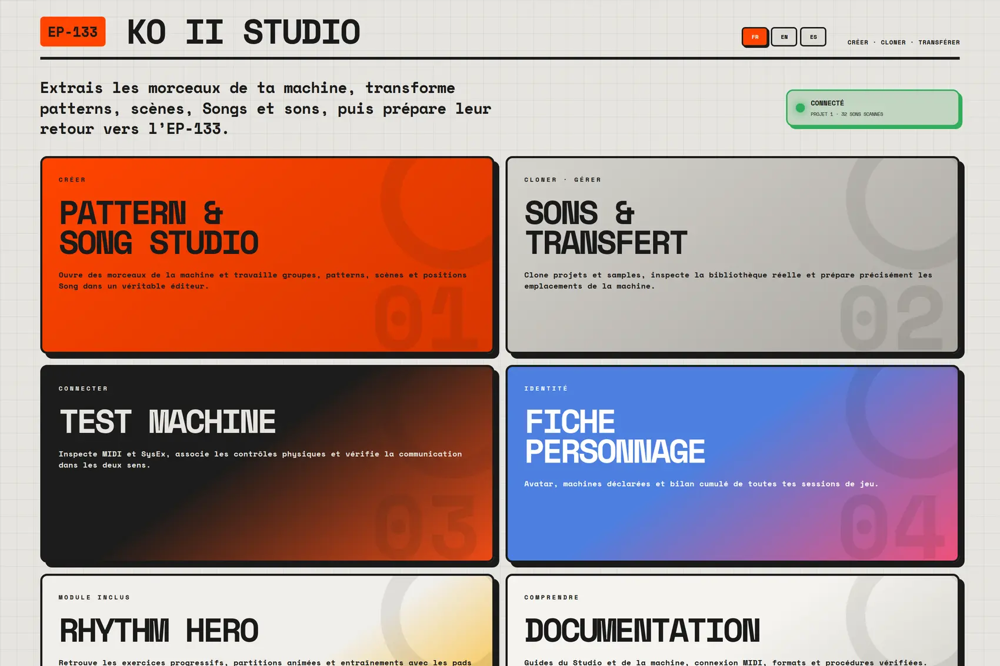
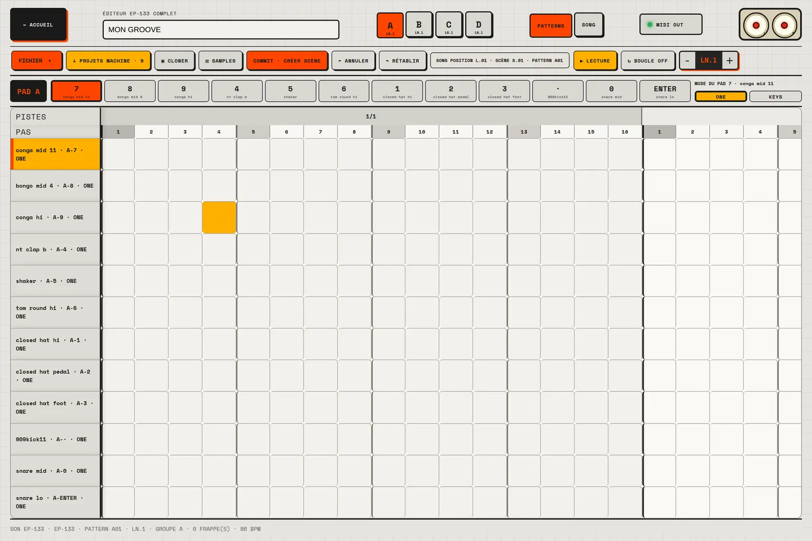
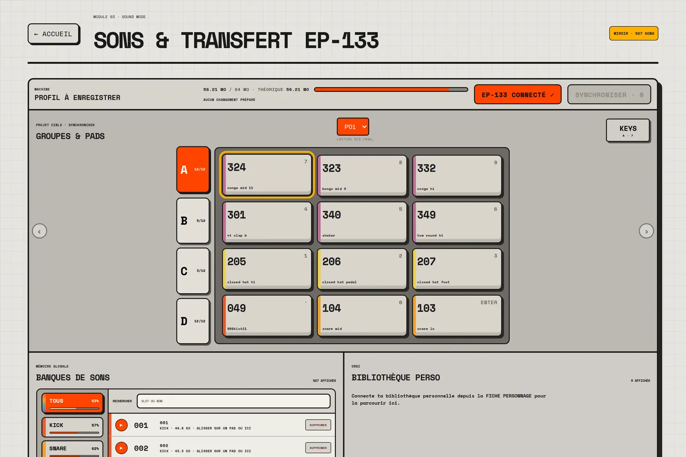
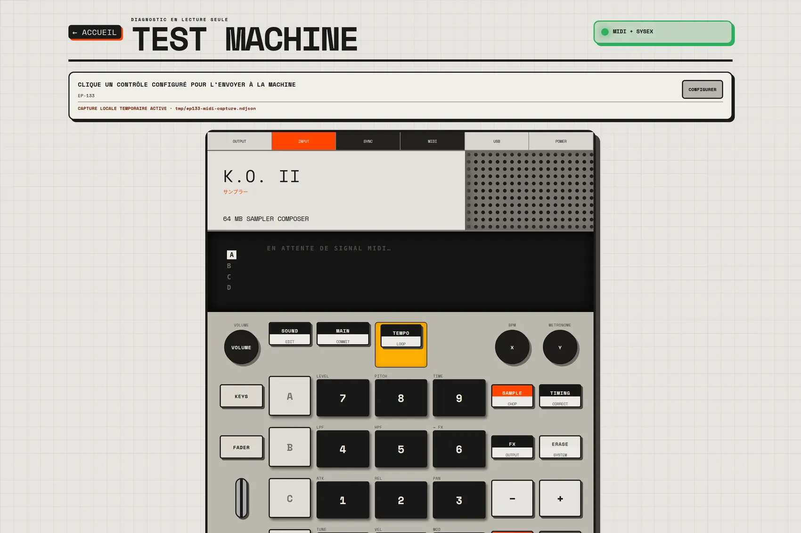
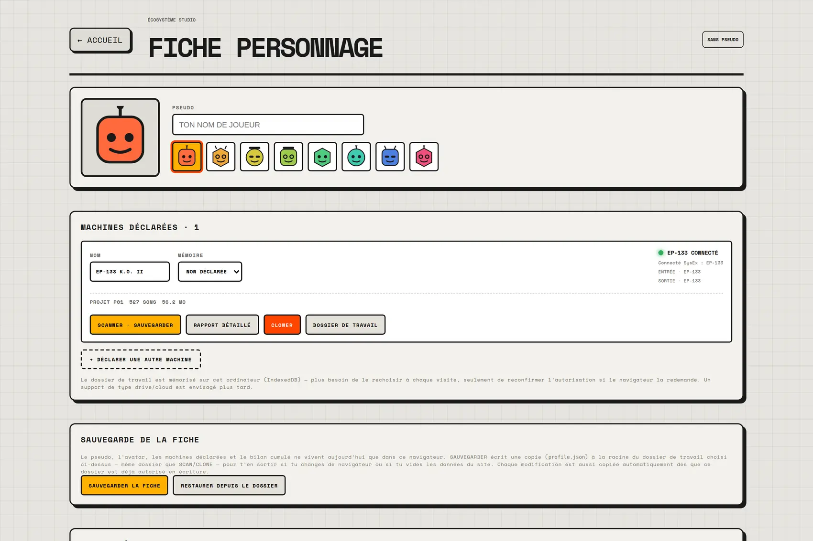
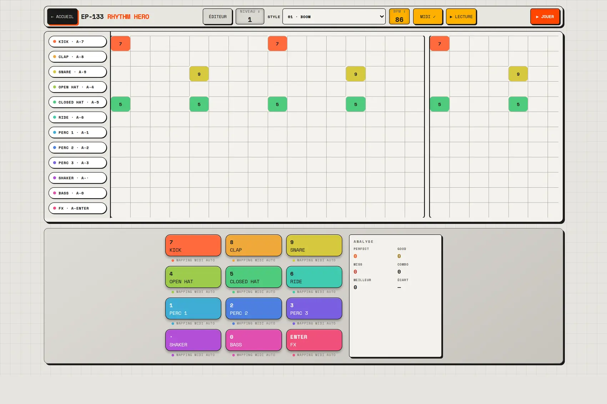

<div align="center">

# EP-133 KO II Studio

**Le studio compagnon open source pour créer avec l'EP-133 K.O. II.**

[Français](README.md) · [English](README.en.md) · [Español](README.es.md)

[](https://github.com/propann/EP-133-KO-II-Studio/actions/workflows/ci.yml)
[](#licence)
[](.nvmrc)



</div>

EP-133 KO II Studio transforme la machine en environnement de production
complet : clone ses projets et ses sons, ouvre les patterns réels, construit
des scènes et des Songs, travaille hors ligne puis écrit un retour vérifié
vers le matériel. Le tout reste local, inspectable et utilisable sans compte.

> **Machine → Studio → création → machine.** Le projet vise un workflow que
> l'EP Sample Tool officiel ne couvre pas : comprendre et retravailler la
> musique contenue dans l'EP-133, pas seulement déplacer des fichiers audio.

> Projet communautaire indépendant. La lecture, le jeu MIDI et la sélection
> active A–D sont disponibles. L'écriture réelle vers la machine (upload de
> son, réaffectation de pad, transfert de projet) est désormais implémentée —
> checkpoint automatique avant chaque écriture, relecture octet à octet et
> confirmation explicite systématiques — et testée en conditions réelles sur
> des cas ciblés. Une campagne de test plus complète reste à faire avant de
> la considérer pleinement fiable ; voir
> [À valider physiquement](docs/A_VALIDER_PHYSIQUEMENT.md). La suppression
> d'un son reste volontairement verrouillée.

## Reprise par une autre IA

Plusieurs agents travaillent sur ce dépôt. Lire d'abord [la passation
complète](docs/AI_HANDOFF.md) : état réel, contraintes, matériel et prochaine
mission, avant toute modification.

## En images

<table>
<tr>
<td width="50%" valign="top">

**Pattern & Song Studio**

Quatre groupes A–D, séquenceur multi-mesures, piano-roll KEYS et Song
Arranger — la même hiérarchie que la machine, à l'écran.



</td>
<td width="50%" valign="top">

**Sons & Transfert**

Glisser-déposer de projets, sélecteur de projet cible, écriture réelle de
sons et de pads — checkpoint et relecture octet à octet à chaque envoi.



</td>
</tr>
<tr>
<td width="50%" valign="top">

**Test Machine**

Façade EP-133 interactive branchée sur le vrai flux MIDI/SysEx, journal en
direct, groupe A–D réellement pressé sur la machine.



</td>
<td width="50%" valign="top">

**Fiche personnage**

Machine déclarée, bilan cumulé, dossier de travail sur le disque —
sauvegarde et restauration en dehors du navigateur.



</td>
</tr>
</table>

## Ce que le Studio permet

- **Cloner la machine** : 9 projets, samples PCM, métadonnées, hashes et
  historique incrémental dans un miroir privé local.
- **Ouvrir de vrais morceaux** : lecture des archives `.pak/.ppak`, patterns
  A–D, scènes, Song Positions, tempo, pads et réglages conservés.
- **Éditer et arranger** : grille multi-mesures, piano-roll KEYS, banques de
  patterns 01–99, scènes partagées et Song Arranger.
- **Travailler avec les vrais sons** : EP-133 connecté en MIDI, samples du
  clone hors ligne, ou moteur audio interne de secours.
- **Envoyer réellement vers la machine** : glisser-déposer un projet entre
  la machine et le logiciel, réaffecter un pad, uploader un son perso —
  checkpoint automatique, écriture, relecture octet à octet et activation.
- **Choisir explicitement la cible** : sélecteur de projet visible dans
  Sons & Transfert, peuplé depuis le dernier scan matériel — jamais une
  détection silencieuse.
- **Diagnostiquer le matériel** : façade interactive, journal MIDI/SysEx brut
  et cartographie des contrôles de la machine.

## Fonctionnalités

### Pattern & Song Studio

- quatre groupes A–D et 12 pads par groupe ;
- séquenceur extensible, piano-roll KEYS, vélocité et durée ;
- lecture locale ou sortie MIDI vers la machine ;
- sauvegarde locale, bibliothèque de projets et export MIDI/JSON ;
- lecture en mode Song à partir des scènes et patterns décodés.

### Clone & bibliothèque sonore

- scan SysEx strictement en lecture seule ;
- copie locale des 9 projets, PCM et métadonnées ;
- hashes SHA-256, reprise et écritures disque atomiques ;
- synchronisation incrémentale et historique des manifestes ;
- lecture des samples du clone lorsque l'EP-133 est déconnecté.

La validation réelle du 10 août 2026 a reconnu **9 projets et 527 sons
inchangés en 30,7 secondes**, sans téléchargement ni erreur. Les 536 hashes ont
été vérifiés indépendamment.

### Sons & Transfert — écriture réelle vers la machine

- glisser-déposer de projets entre la machine (cartes orange = présentes) et
  la bibliothèque du logiciel, dans les deux sens ;
- grille GROUPES & PADS qui suit le vrai projet sélectionné, pas seulement le
  dernier scan — chaque projet a son propre jeu de 48 pads (12 × 4 groupes
  A–D) ;
- SYNCHRONISER : upload de sons perso et réaffectation de pads existants en
  une seule confirmation, avec checkpoint avant écriture et relecture
  octet à octet après ;
- affichage MIDI en direct limité au groupe actuellement affiché, pour
  rester lisible pendant le jeu.

Le pont local (`tools/local_clone_bridge.py`, s'appuie sur
[`epsysex`](https://github.com/kmorrill/ep-series-sysex)) sert de
passerelle entre le navigateur et le protocole FILE de l'EP-133 — voir
[Pont local de clonage](docs/PONT_LOCAL_CLONAGE.md).

### Rhythm Hero — module inclus

Le coach historique reste disponible comme outil secondaire : 39 styles,
cinq niveaux, partition animée, score PERFECT / GOOD / MISS et jeu sur les pads
réels. Il ne définit plus l'identité principale du dépôt.



## Installation rapide

Prérequis : Node.js 22, npm et Chrome/Chromium pour Web MIDI. La version
attendue est indiquée dans `.nvmrc` ; Docker et la CI utilisent également
Node 22.

```bash
git clone https://github.com/propann/ep133-ko-ii-studio.git
cd ep133-ko-ii-studio
npm ci
npm run dev
```

Ouvrir ensuite l'adresse indiquée par Vite, généralement
`http://localhost:5173/`.

## Déploiement web

Le dépôt contient un `Dockerfile` prêt pour Coolify. Il déploie l'interface
React derrière Nginx et expose `/healthz`. Le MIDI et l'accès USB restent
locaux à l'ordinateur auquel l'EP-133 est branché ; un serveur hébergé ne peut
pas accéder au matériel distant. Voir
[le guide de déploiement Coolify](docs/DEPLOIEMENT_COOLIFY.md).

```bash
npm test
npm run build
```

Pour le scan et le clonage matériel, suivre le guide
[Pont local de clonage](docs/PONT_LOCAL_CLONAGE.md). Le player autonome
historique reste disponible dans `docs/ep133-pad-player.html` pendant la
migration de ses exercices.

## État du projet

Le Studio, le Save/Load, la lecture des archives `.pak/.ppak`, le miroir
hors ligne, le clonage incrémental, la hiérarchie complète Patterns/Scènes/Song
(vues Pattern Editor et Song Arranger) et l'écriture réelle vers la machine
(pads, sons, transfert de projets) sont opérationnels. Restent notamment à
faire : campagne de test complète de l'écriture réelle avant de la considérer
pleinement fiable, lecture automatique d'une Song Position à la suivante,
édition avancée de la vélocité/gate, service local automatique et suppression
de son sécurisée.

- [État détaillé](docs/ETAT_DU_PROJET.md)
- [À valider physiquement](docs/A_VALIDER_PHYSIQUEMENT.md)
- [Feuille de route](docs/ROADMAP.md)
- [Journal d'implémentation](docs/SUIVI_IMPLEMENTATION.md)
- [Suivi des traductions FR / EN / ES](docs/SUIVI_TRADUCTIONS.md)
- [Architecture](docs/ARCHITECTURE.md)
- [Validation du clone réel](docs/VALIDATION_CLONE_REEL.md)
- [Point d'étape Sons & Transfert](docs/POINT_SONS_ET_TRANSFERT.md)
- [Contexte et décisions](PROJECT_CONTEXT.md)

## Organisation

- `src/` — Studio React, audio, MIDI, diagnostic, scoring et projets ;
- `public/` — exercices, données publiques et sources MIDI ;
- `docs/` — architecture, validations et guides ;
- `exercises/` — parcours pédagogique et catalogue ;
- `handbook/` — atlas de finger-drumming ;
- `tools/` — scanners, cloneur, pont local et vérifications.

## Sécurité et données

- lecture seule par défaut lors des échanges SysEx ;
- aucun sample propriétaire n'est versionné dans Git ;
- les clones restent dans un dossier privé choisi par l'utilisateur ;
- aucune suppression ou restauration matérielle automatique ;
- les formats inconnus sont préservés, jamais inventés.

## Licence

Code du projet sous licence MIT, sauf mention contraire pour une dépendance.

Teenage Engineering, EP-133 et K.O. II sont des marques de leurs propriétaires.
Ce projet n'est ni affilié ni approuvé par Teenage Engineering.
