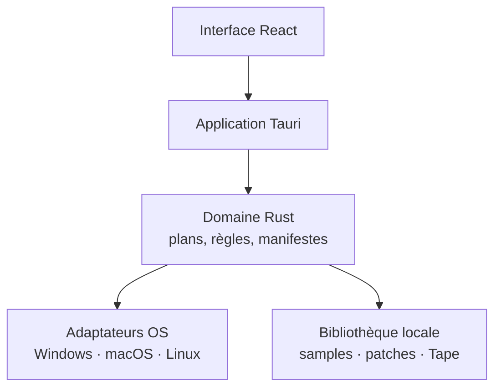
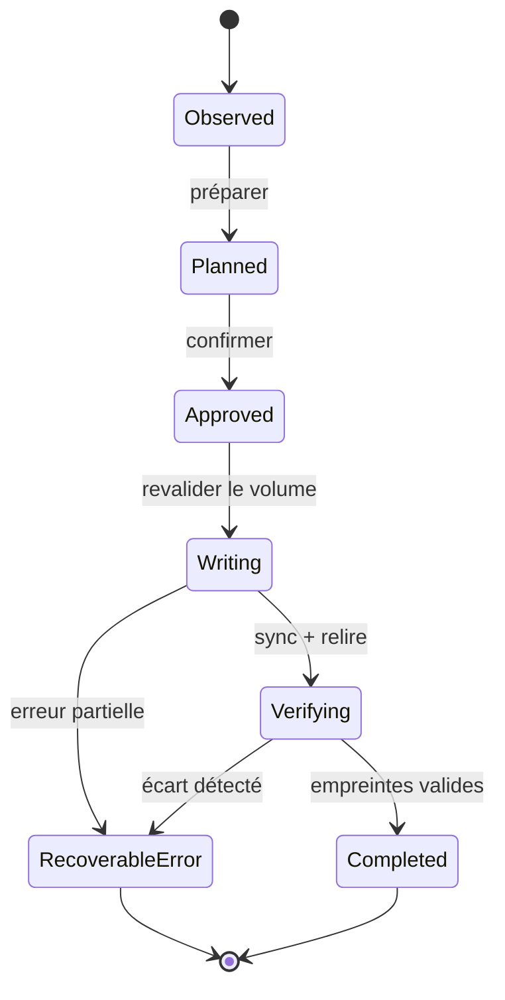

# Architecture technique proposée

## Choix directeur

Le produit est d’abord et volontairement une application **Tauri 2 locale** avec
interface React/TypeScript et cœur Rust. Elle porte toutes les opérations
matérielles, les sauvegardes, le firmware et la bibliothèque locale. Aucun
compte, serveur ou service commercial n’est requis. Une éventuelle extension
distante est gelée hors périmètre jusqu’à ce que le cœur local soit fiable,
installable et validé sur plusieurs systèmes.

Le navigateur standard ne constitue pas une base suffisante pour le firmware. WebUSB protège notamment la classe USB Mass Storage, et la File System Access API dépend du navigateur et d’un choix manuel de dossier ; elle ne fournit pas une stratégie portable d’identification et d’éjection sûre. L’app native est donc le produit matériel de référence. Un pont local navigateur pourra être étudié plus tard, après sécurisation du protocole.

Cette architecture réduit la taille du paquet par rapport à Electron, permet de réutiliser des bibliothèques Rust liées aux patches et garde les opérations critiques dans un langage à mémoire sûre.

## Architecture produit des fenetres

La decomposition fonctionnelle est definie dans
[`FIRMWARE_LAB_FUNCTIONS.md`](FIRMWARE_LAB_FUNCTIONS.md) et
[`WINDOW_FUNCTIONS_SPEC.md`](WINDOW_FUNCTIONS_SPEC.md). Ces documents sont la
reference avant toute extraction de composant ou ajout d'action dans l'UI.

- **Firmware** absorbe **Images** sous un sous-onglet Graphismes ; le conteneur,
  les mods, les ressources audio usine et les visuels restent dans un meme
  ChangePlan.
- **Sauvegardes** porte l'inventaire, les snapshots, la restauration et la
  Time Capsule Pistes.
- **Sons** porte les samples utilisateur, les patches, les pads et les packs.
- **Studio** porte le clone, le MIDI, Tape, Album et le projet local.
- **Exercices** porte l'apprentissage et la performance MIDI.
- **Documentation** porte les fiches propres a chaque fenetre.

L'accueil reste un hub de lancement, pas un moteur metier. Une fenetre peut
preparer un plan local, mais l'execution machine passe uniquement par le coeur
native et une confirmation explicite.

Le profil utilisateur local est un fichier `profile.json` dans le coffre
choisi. Il contient uniquement des preferences et des references vers les
machines, snapshots et projets ; il ne contient ni secret ni identifiant de
compte. L'index Sons reste local. La pile Cloudflare/D1 existante est conservée
comme artefact isolé de recherche et ne participe pas au produit local.

## Couches



### Présentation

- composants accessibles au clavier ;
- états de connexion explicites ;
- waveform et lecture audio sans écriture implicite ;
- résumé humain + détail technique pour chaque plan.

L’interface web actuelle reste une façade de démonstration. Elle ne doit jamais afficher un bouton d’écriture matérielle actif en l’absence de l’application native. Les contrats de domaine sont conçus pour être testés sans matériel grâce aux fixtures.

### Domaine

- `DeviceIdentity` : modèle, mode, point de montage, identifiants USB observés ;
- `DeviceSnapshot` : inventaire immuable et capacité ;
- `ChangePlan` : copies, remplacements, suppressions, espace et préconditions ;
- `BackupManifest` : version de schéma, chemins relatifs, tailles, dates et SHA‑256 ;
- `AudioAsset` : source, format mesuré, durée, aperçu et cible ;
- `FirmwareRelease` : version, URL officielle, notes, empreintes vérifiées localement ;
- `OperationJournal` : phases, résultat de chaque fichier et recommandations de reprise.

### Adaptateurs

- découverte des volumes et périphériques USB/MIDI ;
- lecture/écriture avec synchronisation et éjection natives ;
- décodage, resampling et encodage audio ;
- coffre de sauvegardes local ;
- client HTTPS limité aux origines autorisées ;
- éventuels outils tiers lancés comme processus isolés.

## Modes de la machine

| Mode logique | Signal possible | Droits dans l’application |
|---|---|---|
| Normal | USB audio/MIDI, VID/PID si disponible | Informations et audio/MIDI, pas de fichiers |
| Disk | Volume avec structure OP‑1 attendue | Lecture ; écriture seulement après plan |
| TE‑boot | Petit volume de maintenance attendu | Firmware officiel uniquement |
| Inconnu | Nom ressemblant mais preuves insuffisantes | Lecture système minimale, aucune écriture |

L’identifiant USB `2367:0004` est documenté par le projet `connect-op1` pour l’OP‑1 original, mais il ne suffit pas à lui seul. Le moteur combine plusieurs preuves et exige une structure compatible avant toute mutation.

## Transaction de fichiers



Avant `Writing`, l’application recalcule l’identité du volume, contrôle l’espace libre et compare la génération de l’inventaire. Un fichier est d’abord copié vers un nom temporaire sur la même destination lorsque le format de volume le permet, synchronisé, vérifié, puis renommé. Les suppressions sont reportées à la fin.

## Sauvegardes

Structure proposée :

```text
OP-1 Studio Backups/
└── original-op1_<device-id>/
    └── 2026-08-11T14-32-05Z_<snapshot-id>/
        ├── manifest.json
        ├── device.json
        ├── files/...
        └── previews/...
```

Les fichiers audio ne sont pas dédupliqués dans le premier prototype. Une couche de blobs adressés par contenu pourra être ajoutée après mesure, sans changer le manifeste public. Les aperçus sont reproductibles et ne comptent pas dans la preuve de sauvegarde.

## Audio

Le pipeline mesure toujours le média réel avant conversion : canaux, fréquence, profondeur, durée et pic. La cible OP‑1 originale est un AIFF PCM compatible, généralement mono 44,1 kHz / 16 bits pour les échantillons, avec une limite de 6 s pour le synth sampler et 12 s pour le drum sampler. Les pistes de bande sont conservées à 44,1 kHz / 16 bits.

Les moteurs possibles sont :

- bibliothèques Rust pour l’inspection et les opérations simples ;
- FFmpeg comme sidecar optionnel pour les formats d’entrée larges ;
- `op-patch-util` ou logique compatible pour les métadonnées de patch, après audit de licence et tests.

Une version exacte du sidecar doit être épinglée et son SHA‑256 vérifié à l’installation.

## Firmware

Le cœur standard sait uniquement : lire un catalogue, télécharger depuis une
origine officielle, valider le conteneur connu et conserver localement le
fichier avec ses métadonnées et ses empreintes. Il guide ensuite l’utilisateur
pour déplacer manuellement le fichier sur le volume TE‑boot, demander
l’éjection et suivre l’étape physique suivante.

OP‑1 Studio ne flashe pas le firmware, ne pilote pas le bootloader et ne
prétend pas installer une mise à jour. Il ne décompresse ni ne modifie le
firmware officiel dans le parcours normal et n’écrit pas automatiquement le
volume TE‑boot. Toute opération de contenu est bloquée tant qu’une sauvegarde
vérifiée n’est pas liée au `ChangePlan`.

L’analyse/repack communautaire est un module séparé, désactivé par défaut et incapable d’écrire directement sur un volume. Voir [FIRMWARE_SAFETY.md](FIRMWARE_SAFETY.md).

## Samples, patches et remplissage

Le remplissage de la machine passe par le même `ChangePlan` que le firmware : l’application inspecte d’abord la destination, affiche les fichiers ajoutés/remplacés, vérifie l’espace et conserve les fichiers inconnus. Un éditeur de patch simple manipule uniquement une copie locale, permet de régler les paramètres exposés par le format, puis exporte un fichier marqué comme nouveau avant tout transfert.

Les formats propriétaires ou partiellement documentés sont traités en lecture prudente. L’application ne réécrit pas une base interne inconnue et ne supprime jamais automatiquement un fichier existant.

## Stockage de configuration

- préférences : configuration applicative native, sans secret ;
- catalogue : JSON signé ou livré avec l’application, rafraîchi depuis une source contrôlée ;
- bibliothèque : SQLite locale pour l’index, fichiers audio hors base ;
- sauvegardes : manifestes JSON versionnés et lisibles sans l’application ;
- journaux : rotation locale, chemins personnels pseudonymisés.

## Tests

| Niveau | Cible | Matériel réel requis |
|---|---|---|
| Unitaire | règles de chemin, plans, limites, manifestes | Non |
| Fixture | volumes Disk/TE‑boot simulés, pannes injectées | Non |
| Intégration | sidecars audio et systèmes de montage | Non |
| Hardware-in-loop | détection, copie, sync, eject | Oui, volontaire |
| Firmware | parcours officiel sur matrice OS/version | Oui, protocole strict |

Les tests de fixture doivent inclure fichiers inconnus, casse différente, noms Unicode, manque d’espace, volume remounté et interruption après chaque étape d’écriture.

## Décisions encore ouvertes

- bibliothèque audio Rust pure ou FFmpeg obligatoire ;
- stratégie d’identifiant stable de machine sans collecter de série sensible ;
- méthode d’éjection native par plateforme ;
- support exact des alias de fichiers `sideA`, `SideA` ou `side_a` ;
- limites réelles de patches selon version OS et espace disponible ;
- format du projet Studio avant rendu vers quatre stems.
