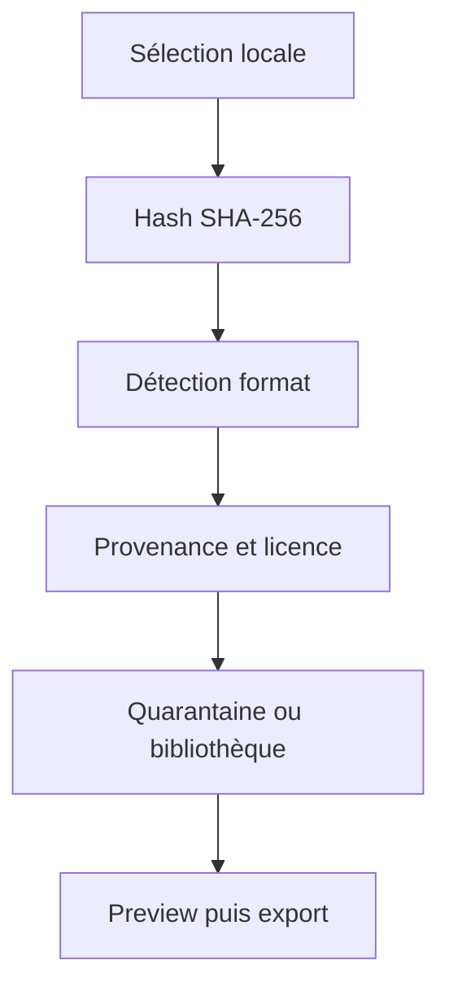

# Dépôt local universel de contenu

Le dépôt universel est un **coffre local indexé**, pas un miroir public de
firmwares ou de packs tiers. OP-1 Studio doit pouvoir réunir au même endroit
les patches synthé, kits drum, samples, projets Tape, thèmes, sauvegardes et
fichiers `.op1`, tout en conservant la provenance de chaque élément.

## Ce qui est livré

Le registre des sources est dans
[`data/content/sources.json`](../data/content/sources.json). Le script
[`tools/content_catalog.py`](../tools/content_catalog.py) crée les dossiers,
calcule les SHA-256 et détecte les fichiers ajoutés, modifiés, manquants ou
non indexés. Il ne contacte aucun service et ne téléverse rien.

Initialiser un coffre depuis PowerShell, Git Bash ou Linux :

```bash
python3 tools/content_catalog.py init /chemin/vers/OP-1-Studio-Library
python3 tools/content_catalog.py scan /chemin/vers/OP-1-Studio-Library
python3 tools/content_catalog.py verify /chemin/vers/OP-1-Studio-Library
```

Sous Windows, le chemin peut être par exemple
`C:\Users\azoth\Documents\OP-1-Studio-Library`.

## Arborescence retenue

```text
OP-1-Studio-Library/
├── backups/
├── content/
├── exports/
├── firmware/
│   ├── official/       # copies locales, jamais committées
│   └── modded/         # résultats UNOFFICIAL-MODIFIED
├── manifests/          # library.json + sidecars de provenance
├── packs/
├── patches/
│   ├── drum/
│   ├── sampler/
│   └── synth/
├── quarantine/         # licence/provenance inconnue
├── samples/
├── tapes/
└── themes/
```

Chaque entrée doit conserver au minimum : chemin relatif, type, taille,
SHA-256, modèle visé, compatibilité firmware, auteur, source/URL, licence,
date d'import et statut. Le scanner conserve les champs édités par l'utilisateur
lors des scans suivants.

## Pipeline d'import sûr



1. Copier ou déplacer explicitement le fichier dans le coffre.
2. Scanner et vérifier son hash.
3. Reconnaître le type (`.aif/.aiff`, audio, `.svg`, `.op1`, archive) sans
   supposer qu'une extension prouve la compatibilité.
4. Ajouter la provenance, l'auteur et la licence dans le manifeste ou le
   sidecar associé.
5. Garder en `quarantine` tout contenu dont les droits ou le modèle ne sont
   pas clairs.
6. Générer un aperçu local avant transfert vers l'OP-1.

Le produit ne doit pas scraper `op1.fun`, aspirer un compte, télécharger en
masse des packs payants ni republier du contenu utilisateur. Les compteurs de
`op1.fun` observés le 11 août 2026 (12 674 patches et 24 284 packs) sont
dynamiques et servent uniquement à mesurer l'écosystème, pas à remplir
automatiquement le coffre.

## Règles de licence

- Les sauvegardes et sons créés par l'utilisateur peuvent rester dans son
  coffre local.
- Les codes MIT/GPL restent séparés du contenu audio et gardent leurs notices.
- Les packs communautaires restent liés à leur auteur et à leurs conditions.
- Un contenu propriétaire ou de licence inconnue peut être indexé localement
  pour l'utilisateur, mais n'entre pas dans Git ni dans une release.
- Les firmwares et les manuels Teenage Engineering restent hors du dépôt Git.

Le modèle vide est disponible dans
[`data/content/library-manifest.example.json`](../data/content/library-manifest.example.json).
