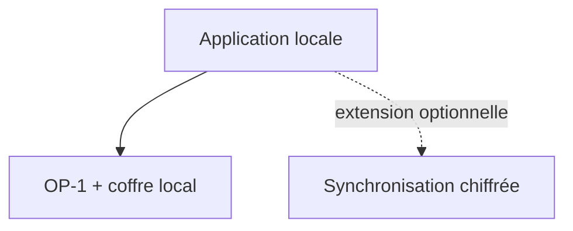

# Modèle économique proposé

## Décision

Le produit devient **hybride** :

- une application de bureau gratuite gère l’OP‑1 et les données locales ;
- un service web optionnel apporte continuité, cloud et fonctions communautaires ;
- la même interface React et le même compte peuvent être utilisés dans l’app et le navigateur ;
- le navigateur seul ne promet jamais un contrôle matériel qu’il ne peut pas sécuriser.

Cette séparation rend l’outil utile sans serveur et donne à l’abonnement une valeur continue. Elle évite aussi de bloquer une restauration urgente derrière un paiement.

## Offres à tester

Les prix sont des **hypothèses de recherche**, pas une grille définitive.

| Offre | Prix test | Contenu |
|---|---:|---|
| Community | 0 € | Détection, sauvegardes locales, restauration vérifiée, firmware officiel, bibliothèque locale, Tape |
| Studio Cloud | 4–6 €/mois ou 35–49 €/an | Historique chiffré distant, synchronisation multi‑ordinateur, profils de machine, partage privé, priorité support |
| Supporter | achat unique à tester | Badge, thèmes et soutien au développement ; aucune fonction de sécurité exclusive |

Une offre Creator plus chère ne sera envisagée qu’avec une vraie valeur professionnelle : stockage audio important, collaboration, packs commerciaux ou gestion de plusieurs machines.

## Ce qui ne doit pas être payant

- création et vérification d’une sauvegarde locale ;
- restauration locale ;
- installation guidée d’un firmware officiel déjà téléchargé ;
- inspection de l’intégrité ;
- export de ses propres fichiers ;
- accès aux journaux nécessaires pour récupérer d’une erreur.

Ces fonctions forment la confiance de base. Les paywall rendrait l’application moins sûre et pousserait les utilisateurs vers des procédures manuelles au pire moment.

## Valeur récurrente du service

- sauvegardes chiffrées côté client et versionnées ;
- reprise sur un nouvel ordinateur ;
- catalogue de sons avec tags, favoris et détection de doublons ;
- import volontaire depuis des partenaires ou packs autorisés ;
- partage privé d’un projet Tape avec stems et snapshot source ;
- profils et diagnostics historiques de plusieurs machines ;
- veille sur firmwares officiels, incompatibilités et alertes critiques ;
- support guidé à partir d’un journal expurgé envoyé volontairement.

## Architecture commerciale

L’utilisateur doit pouvoir ne jamais activer la synchronisation et conserver l’accès complet à son matériel, ses sauvegardes, ses samples et ses patches locaux.

## Licence

Le code de l’application est placé sous **licence MIT**. Cela permet les forks, les intégrations commerciales et un éventuel service hébergé sans transformer la sécurité firmware en barrière propriétaire. La valeur du produit repose sur la qualité de l’application, la compatibilité matérielle, les sauvegardes vérifiées, l’expérience de remplissage de la machine et le support.

La licence MIT ne couvre pas les firmwares propriétaires, les manuels, les marques, les sons ou les patches tiers. Chaque dépendance et chaque contenu importé gardent leurs propres conditions.

## Expériences avant tarification

1. Entretiens : demander la dernière perte ou peur de perte, pas « paieriez-vous ? ».
2. Test de comportement : offrir une seconde sauvegarde locale et mesurer l’usage.
3. Faux choix tarifaire non encaissé : mensuel, annuel, soutien unique.
4. Précommande remboursable uniquement après démonstration d’une bêta stable.
5. Cohorte : mesurer la rétention à 30 et 90 jours avant d’augmenter le stockage gratuit.

## Économie à surveiller

- stockage et trafic des quatre pistes Tape ;
- conversion et génération d’aperçus audio ;
- support lié aux câbles, hubs, pilotes et systèmes de fichiers ;
- signature/notarisation de l’app sur trois plateformes ;
- assurance et conseil juridique autour du firmware ;
- faible fréquence de mise à jour de l’OP‑1 original.

La marge du service sera meilleure si les sauvegardes sont dédupliquées, incrémentales et chiffrées avant envoi, avec une politique de rétention transparente.
