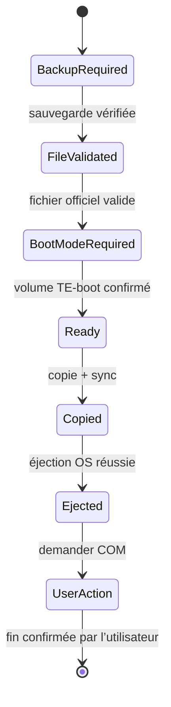

# Politique de sécurité du firmware

La mise à jour firmware est le parcours le plus sensible du produit. Le but n’est pas de la rendre invisible, mais de supprimer les ambiguïtés et de guider l’utilisateur sans jamais lui faire croire qu’une opération risquée est garantie.

## Deux espaces strictement séparés

### Firmware officiel

Parcours standard, visible dans l’application. Il accepte seulement une version répertoriée pour l’OP‑1 original et téléchargée depuis `teenage.engineering` à la demande de l’utilisateur.

### Labo expert

Parcours expérimental, désactivé par défaut. Il peut inspecter ou préparer un fichier avec des outils communautaires, mais ne peut jamais l’écrire directement sur la machine. L’utilisateur doit exporter le résultat, lire un avertissement distinct et effectuer ensuite une procédure manuelle.

## Préconditions obligatoires du parcours officiel

- machine identifiée comme OP‑1 original ;
- sauvegarde complète récente dont le manifeste a été vérifié ;
- batterie suffisamment chargée et alimentation USB stable ;
- fichier provenant de l’URL officielle répertoriée ;
- version et modèle confirmés par l’utilisateur ;
- TE‑boot ouvert sur la fonction de mise à jour, pas sur reset/format ;
- volume cible reconnu sans ambiguïté ;
- aucun autre volume portant un nom ressemblant utilisé par défaut.

## Validations du fichier

1. URL HTTPS et hôte exact autorisé.
2. Taille non nulle et raisonnable selon le catalogue.
3. extension `.op1` seulement comme indice, jamais comme preuve.
4. CRC‑32 embarqué validé selon le format documenté par la communauté.
5. flux LZMA et archive TAR inspectables sans extraction de chemins dangereux.
6. structure minimale attendue et absence de traversée de chemin.
7. SHA‑256 comparé à une empreinte approuvée lorsqu’elle est disponible.

Le catalogue initial laisse le SHA‑256 vide tant qu’un processus de publication reproductible n’a pas confirmé la valeur depuis le fichier officiel. L’application peut calculer une empreinte locale, mais elle ne doit pas présenter celle-ci comme une signature de l’éditeur.

## Déroulement

L’application s’arrête avant chaque transition si la machine est déconnectée, si le volume change d’identité ou si une précondition devient fausse.

## Ce que l’application ne fait jamais

- déclencher une réinitialisation usine ou un formatage ;
- couper l’alimentation ou redémarrer automatiquement la machine ;
- supprimer le firmware précédent du stockage interne ;
- modifier silencieusement un firmware officiel ;
- choisir une version sur la seule base d’un nom de fichier ;
- télécharger depuis un miroir communautaire dans le parcours standard ;
- considérer la réussite de la copie comme la réussite de l’installation ;
- masquer une erreur d’éjection.

## Gestion des erreurs

| Moment | Réponse |
|---|---|
| Téléchargement interrompu | Supprimer le fichier partiel ou le garder avec suffixe `.partial`, jamais l’utiliser |
| CRC/structure invalide | Bloquer, conserver un diagnostic sans extraire le contenu |
| Volume disparu avant copie | Annuler sans rechercher automatiquement un autre volume |
| Copie partielle | Signaler le chemin exact, tenter une synchronisation, ne pas demander de presser COM |
| Éjection refusée | Montrer les processus possibles et attendre ; ne jamais suggérer de débrancher |
| Machine ne redémarre pas | Lien vers TE‑boot officiel et support constructeur ; ne pas improviser de procédure destructive |

## Labo expert et `op1repacker`

`op1repacker` et son interface graphique sont sous licence MIT et savent décompresser/recompresser ou modifier certaines versions de firmware. Ils avertissent qu’un firmware modifié peut annuler la garantie ou rendre l’appareil inutilisable.

Conditions minimales avant une éventuelle intégration :

- version épinglée et code audité ;
- exécution hors du processus principal ;
- entrée et sortie dans un dossier temporaire privé ;
- aucune clé ou protection embarquée dans OP‑1 Studio ;
- résultat marqué `UNOFFICIAL-MODIFIED` dans l’interface et dans le journal ;
- aucun bouton « installer » dans le même écran ;
- tests sur fichiers de démonstration légalement redistribuables.

## Réponse aux incidents

Tout bug susceptible de viser le mauvais volume ou de déclarer un firmware invalide comme valide est traité comme une vulnérabilité. Voir [SECURITY.md](../SECURITY.md).

