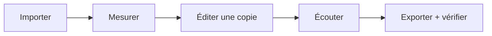

# Éditeur simple de patches

## Objectif

Donner un espace clair pour comprendre et modifier un patch sans obliger l’utilisateur à ouvrir un outil de reverse engineering. L’éditeur travaille sur une copie locale et ne touche jamais directement au volume de l’OP‑1.

## Première version

- bibliothèque des patches et kits locaux ;
- recherche par nom, type et tags ;
- aperçu audio avant et après modification ;
- nom et catégorie ;
- paramètres simples exposés par le format reconnu : cutoff, résonance, drive, enveloppe et niveau ;
- export d’une copie avec manifeste ;
- plan de transfert séparé, après sauvegarde.

## Formats et prudence

Le dépôt ne doit pas inventer un format binaire propriétaire. L’intégration d’un codec ou d’un éditeur communautaire doit être précédée d’un audit de licence, d’un commit épinglé et de fixtures légales. Tant que le format exact n’est pas validé, l’interface peut éditer un projet local descriptif et un sample compatible, mais elle ne doit pas prétendre produire un patch OP‑1 installable.

## Parcours cible

Le transfert vers la machine n’apparaît qu’après l’export validé et la liaison à un `ChangePlan`.
